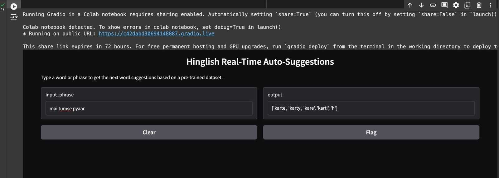

# TextFlow : Hinglish Auto-suggestions

**Team Number**: 16

TextFlow focuses on building an NLP-based auto-suggestion system for Hinglish—a blend of Hindi and English widely used in India. Our goal is to preprocess Hinglish text, analyze it, and train a model for generating context-aware suggestions.

---

## Dataset Links

We use the following datasets from Hugging Face:

- [Training Dataset](https://huggingface.co/datasets/DanArnin/Hinglish/viewer/default/train)
- [Validation Dataset](https://huggingface.co/datasets/DanArnin/Hinglish/viewer/default/validation)

---

## Preprocessing Steps

1. **Data Extraction**  
   - Extracted sentences with more than one word from the `hi_ng` column for meaningful input.

2. **Data Cleaning**  
   - Removed URLs, emails, alphanumeric words, special characters, and extra spaces.

3. **Normalization**  
   - Converted text to lowercase for consistency.

4. **Tokenization**  
   - Split sentences into words using `word_tokenize` from NLTK.

---

## About the dataset 

1. **Dataset(Training)**
   -Training Dataset contains 188525 sentences. the unique words are 38200.
   -it has one column called "Phrases".


## Exploratory Data Analysis (EDA)

- Analyzed sentence length distribution.
- Identified common words using frequency plots and word clouds.
- Explored bigrams and trigrams for contextual understanding.
- Compared training and validation sets for similarity.

---

## Bigram-Based Auto-Suggestions

To generate word suggestions, we implemented a bigram-based approach, which creates pairs of consecutive words (bigrams) from the Hinglish dataset. However, it’s important to note that bigrams, as a basic n-gram technique, do not capture long-range dependencies or deeper contextual understanding within the text. This means that while bigrams can provide useful next-word predictions based on the immediate preceding word, they lack the ability to consider broader sentence context or semantic meaning.

This limitation makes bigram-based models less effective for more complex language tasks, where context plays a crucial role.

---

### **Steps Followed in the Bigram Code:**

1. **Dataset Loading:**
   - The dataset (containing Hinglish phrases) is loaded from an Excel file located at `/content/data.xlsx`.

2. **Data Preprocessing:**
   - A function `preprocess_dataset()` is defined to process the dataset:
     - **Cleaning**: It converts text to lowercase and removes numbers using regex.
     - **Word Pair Creation**: It extracts consecutive word pairs (bigrams) from the phrases.
     - **Top Word Pair Selection**: For each word in the dataset, the function keeps the 5 most common word pairs that follow it.

3. **Saving Processed Data:**
   - The top word pairs are saved to a JSON file (`top_word_pairs.json`) for future use.

4. **Gradio Interface:**
   - The `get_next_word_suggestions()` function takes the user's input and generates suggestions based on the last word typed, by checking the preprocessed word pairs.
   - A Gradio interface is created with a live textbox for users to input their phrase. The system will show up to 5 suggestions for the next word.

5. **Interface Launch:**
   - The Gradio interface is launched, providing real-time interaction for users to test the auto-suggestions.



[Watch the video on YouTube](https://youtu.be/9Ds56z9EykM)


---

## Next Steps

We aim to improve the suggestion system by exploring more advanced techniques, such as neural language models, which can capture more complex relationships and context within the Hinglish language.

---

### Training using Distill bert

we used distil bert model for training as it is light weight and is one the faster in all bert model. but since the dataset have 1.8L sentences and whereas the unique words are only 38200. because of the ratio between words and sentence is too less.the model is overfitting. we tried to use different parameters still the result is similar.

## Requirements

Install the required libraries:

```bash
pip install pandas nltk gradio matplotlib seaborn wordcloud scikit-learn

